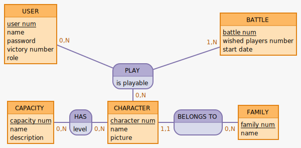

# Zef's Battle Game

**An open battle game with character cards.**

&nbsp;

## Game Rules

This game is an open battle that is played by two or more.

Each player receives a certain number of cards, distributed randomly at the start of the game. These cards each contain a character who has characteristics with a certain number of points for each of them.

Each turn, players choose one of their cards and play it face down. When all players have chosen their card, they are turned face up and compared. The card with the highest sum of points wins the round and allows the player who owns it to collect the other cards. These recovered cards can no longer be played.

The game ends when all players have used all their cards and the winner is the one who has won the most cards.

&nbsp;

## The project

This project contains a back-end part with a server based on Node.js and Express as well as a PostgreSQL database and a front-end part made with React and Redux.

&nbsp;

### The database

#### MCD:

#### MLD:
* USER (__user_num__, name, password, language, victory_number, role)
* BATTLE (__battle_num__, start_date, #family_num)
* CAPACITY (__capacity_num__, name)
* CHARACTER (__character_num__, name, picture, family, #family_num)
* FAMILY (__family_num__, name)
* USER_PLAY_BATTLE (#user_num, #battle_num)
* PLAYER_HAS_CHARATER (#battle_num, #character_num)
* CHARACTER_HAS_CAPACITY (#capacity_num, #character_num, level)

#### data dictionary:

&nbsp;

___

&nbsp;

**Un jeu de bataille ouverte avec des cartes de personnages.**

&nbsp;

## Règles du jeu

Ce jeu est une simple bataille ouverte qui se joue à deux ou plus.

Chaque joueur reçoit un certain nombre de cartes, distribuées au hasard, en début de partie. Ces cartes représentent chacune un personnage qui possède des caractéristiques avec un certain nombre de points pour chacune d'elles.

A chaque tour, les joueurs choisissent une de leur carte et la joue face cachée. quand tous les joueurs ont joué leur carte, celles-ci sont retournées face visible et comparées.
La carte dont la somme des points est la plus élevée remporte le tour et permet au joueur qui la possède de récupèrer les autres cartes jouées. Ces cartes ne pourront plus être jouées.

Le jeu se termine quand tous les joueurs ont joué toutes leurs cartes et le gagnant est celui qui a récupéré le plus de carte.

&nbsp;

## Le projet

Ce projet est constitué d'une partie back-end avec un serveur monté avec Node.js et Express ainsi qu'une base de données PostgreSQL, et une partie front-end réalisée avec React et Redux.

&nbsp;

### La base de données

#### MCD :

#### MLD :
* USER (__user_num__, name, password, language, victory_number, role)
* BATTLE (__battle_num__, start_date, #family_num)
* CAPACITY (__capacity_num__, name)
* CHARACTER (__character_num__, name, picture, family, #family_num)
* FAMILY (__family_num__, name)
* USER_PLAY_BATTLE (#user_num, #battle_num)
* PLAYER_HAS_CHARATER (#battle_num, #character_num)
* CHARACTER_HAS_CAPACITY (#capacity_num, #character_num, level)

#### Dictionnaire des données :